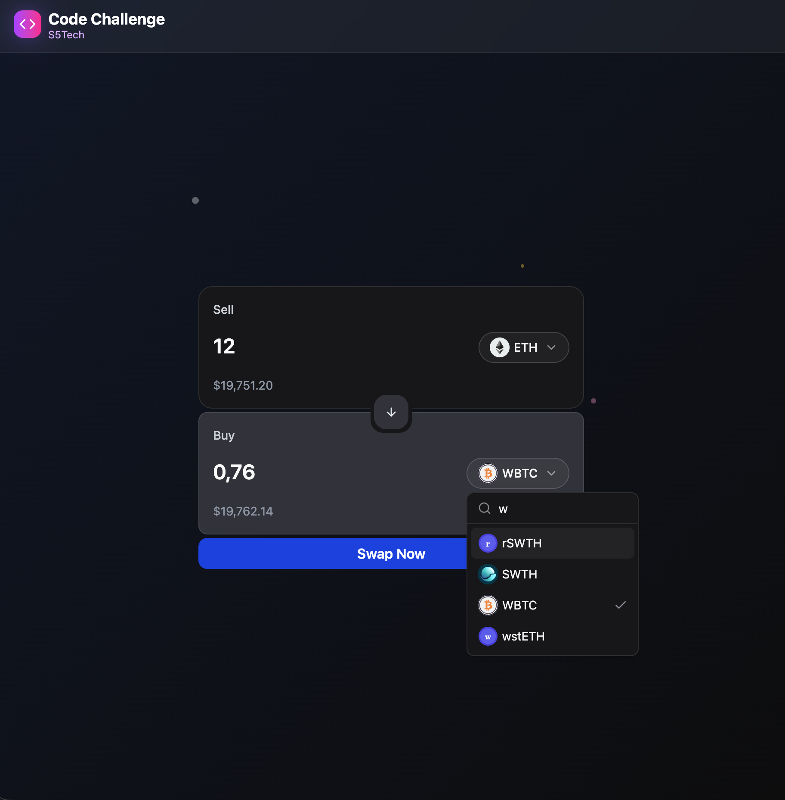

# 99Tech Code Challenge #1

This repository contains solutions to three programming challenges demonstrating algorithm optimization, frontend development, and code refactoring skills.

---

## Problem 1: Three Ways Sum

**Challenge**: Calculate the sum from 1 to n using three different approaches.

**Solution**: Implemented three methods with varying time and space complexity:
- **Formula**: `n(n+1)/2` - Constant time O(1), constant space O(1)
- **Recursion**: O(n) time and space complexity
- **Loop**: O(n) time, O(1) space

**Location**: `src/problem1/three-ways-sum.js`

---

## Problem 2: Currency Swap Application

**Challenge**: Build a cryptocurrency exchange interface with real-time exchange rates.

**Solution**: React + TypeScript application featuring:
- Real-time exchange rates from Switcheo API
- Debounced input (500ms) to minimize API calls
- Skeleton loading states for smooth UX
- Global state management with Zustand
- Modern UI with animated gradient background
- Responsive design with TypeScript

**Location**: `src/problem2/`

**Application Screenshot**: 

**To Run**:
```bash
cd src/problem2
npm install
npm run dev
```

---

## Problem 3: Code Refactoring

**Challenge**: Fix bugs and refactor messy React code.

**Solution**: Identified and fixed 11 issues including:
- Logic bugs in filtering and sorting
- Performance issues with unnecessary re-renders
- Type safety problems with missing interfaces
- React anti-patterns (using array index as key)

Refactored code follows SOLID principles with clean architecture:
- Separated business logic from UI using a `WalletProcessor` class
- Chainable API for wallet operations
- Proper TypeScript typing and memoization

**Files**:
- `src/problem3/messy.tsx` - Original buggy code
- `src/problem3/improve.tsx` - Refactored solution

---

## Submission

Solutions are ready for review. All code is well-commented and follows best practices.
